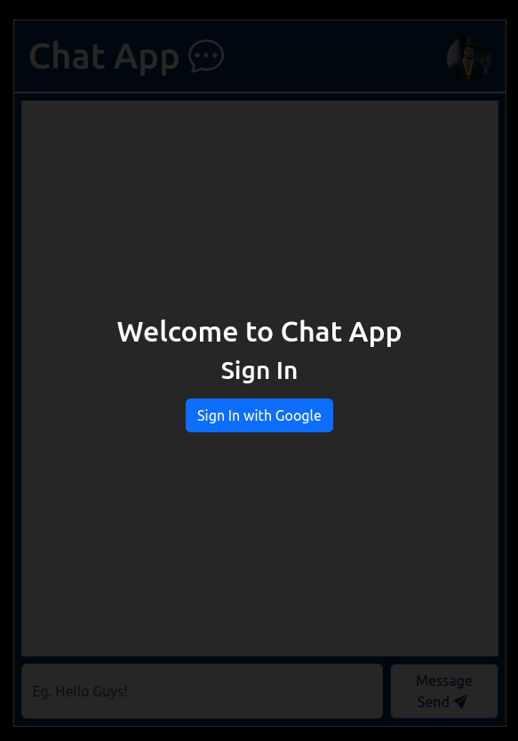
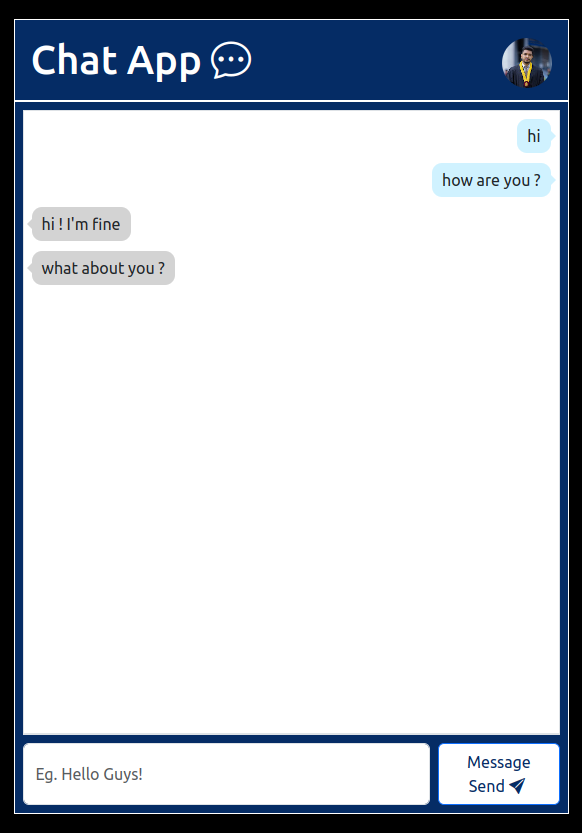

# Chat Application with Spring WebSocket

## Version
0.1.0

## Introduction

Welcome to the Chat Application with Spring WebSocket! This project enables real-time chat functionality with multiple users using Spring WebSocket. The frontend is developed using React, and the backend is built on the Spring framework with WebSocket support. Users can log in using Firebase Google Authentication.

### Features

- **Real-time Chat:** Experience instant messaging with multiple users.
- **User Authentication:** Log in securely using Firebase Google Authentication.
- **WebSocket:** Utilize Spring WebSocket for real-time communication.

### Preview

## Technologies Used

### Frontend

- **Build Tool:** Parcel
- **Icons:** Bootstrap Icons
- **Authentication:** Firebase Authentication

### Backend

- **Framework:** Spring (Spring MVC, Spring WebSocket)
- **Validation:** Hibernate Validator
- **JSON Processing:** Jackson Databind
- **Build Tool:** Maven

## License

Copyright &copy; 2024 Pravinda Bandara. All Rights Reserved
This project is licensed under the [MIT License](LICENSE.txt).
